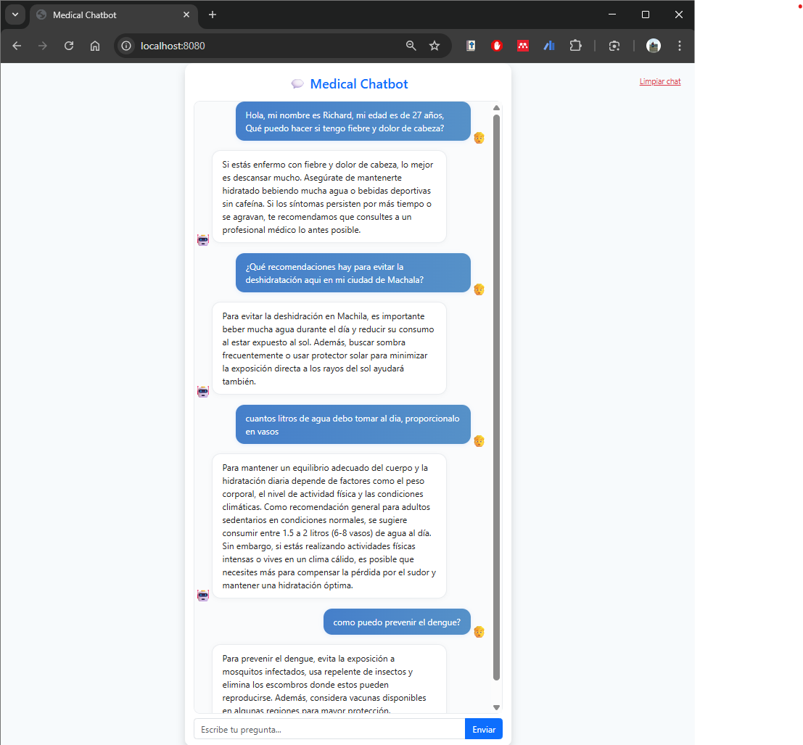

# End-to-End-Medical-Chatbot-Generative-AI

## Demo




## Instalación y ejecución local

1. Clona el repositorio:
    ```bash
    git clone https://github.com/TU-USUARIO/End-to-End-Medical-Chatbot-Generative-AI.git
    cd End-to-End-Medical-Chatbot-Generative-AI
    ```

2. Crea y activa un entorno virtual:
    ```bash
    python -m venv venv
    # En Linux/macOS
    source venv/bin/activate
    # En Windows
    venv\Scripts\activate
    ```

3. Instala las dependencias del proyecto:
    ```bash
    pip install -r requirements.txt
    ```

4. Descarga e instala [Ollama](https://ollama.com/) desde la web oficial.  
   Luego, en tu terminal, ejecuta:
    ```bash
    ollama pull phi3
    ```
   Esto descargará el modelo Phi3 para usarlo en local.

5. Configura la API Key de Pinecone:  
   Crea un archivo llamado `.env` en la raíz del proyecto (si no existe) y agrega la siguiente línea, reemplazando con tu clave real:
    ```
    PINECONE_API_KEY=tu_clave_aqui
    ```

6. Ejecuta la aplicación:
    ```bash
    python app.py
    ```

7. Accede a [http://localhost:5000](http://localhost:5000) en tu navegador para usar el chatbot.

---

> **Notas importantes:**
> - Cambia la clave de Pinecone en el archivo `.env` antes de ejecutar la aplicación.
> - Ollama y el modelo Phi3 deben estar correctamente instalados para que el chatbot funcione.
> - Si tienes problemas con las dependencias, verifica que el entorno virtual esté activado.

