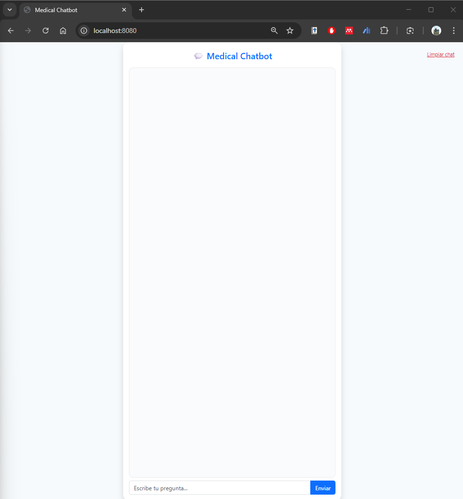

# End-to-End-Medical-Chatbot-Generative-AI

## Demo




## Instalación y ejecución local

### 1. Clonar el repositorio
```bash
git clone https://github.com/TU-USUARIO/End-to-End-Medical-Chatbot-Generative-AI.git
cd End-to-End-Medical-Chatbot-Generative-AI

python -m venv venv
source venv/bin/activate        # En Linux/macOS
venv\Scripts\activate          # En Windows

pip install -r requirements.txt

Descarga e instala Ollama desde la web oficial.

ollama pull phi3 #Esto descargará el modelo Phi3 para usarlo en local.


#  5. Configurar la API Key de Pinecone
PINECONE_API_KEY=tu_clave_aqui


python app.py


Accede a http://localhost:5000 en tu navegador.